# Multistep Indices Validation Report
#### last update - 14th June 2024

## Product information
### General Formula of the Multistep Indices

 The Multi Step Indices is based on the discrete-time random walk, the price at time \(t\) is given by the following equation:

$$
x_t = x_0 + \sum_{i=1}^{t} s_i
$$

where:
- $x_t$ is the position at time $t$,
- $x_0$ is the initial position,
- $s_i$ represents the step taken at time $i$, which is randomly selected from a set of possible step sizes, each associated with a specific probability.

The steps $s_i$ are independently distributed, drawn from a predefined set of step sizes with associated probabilities. This setup results in a model where the movement direction and magnitude at each step are stochastic.

### Proposal of Parameters

The parameters for the random walk are defined in terms of the step sizes and their associated probabilities. Below are the parameters for each proposal:

#### Multi Step Index 2 - multistpRNG2

| **Step size**     | 0.5  | 0.1   | -0.1  | -0.5  |
|--------------|------|-------|-------|-------|
| **Probabilities** | 0.025| 0.475 | 0.475 | 0.025 |
| **CumSum**        | 0.025| 0.5   | 0.975 | 1.0   |

#### Multi Step Index 3 - multistpRNG3

| **Step size**     | 0.5  | 0.25  | 0.1   | -0.1  | -0.25 | -0.5  |
|--------------|------|-------|-------|-------|-------|-------|
| **Probabilities** | 0.015| 0.01  | 0.475 | 0.475 | 0.01  | 0.015 |
| **CumSum**        | 0.015| 0.025 | 0.5   | 0.975 | 0.985 | 1.0   |

#### Multi Step Index 4 - multistpRNG4

| **Step size**     | 0.5  | 0.3   | 0.2   | 0.1   | -0.1  | -0.2  | -0.3  | -0.5  |
|--------------|------|-------|-------|-------|-------|-------|-------|-------|
| **Probabilities** | 0.005| 0.01  | 0.01  | 0.475 | 0.475 | 0.01  | 0.01  | 0.005 |
| **CumSum**        | 0.005| 0.015 | 0.025 | 0.5   | 0.975 | 0.985 | 0.995 | 1.0   |

### Spread 

The spread are set by dealing team. The current spread are configured as below:

| **Index**     | **Bid Spread**  | **Ask Spread**  | 
|--------------|------|-------|
| Multi Step 2 | -0.1 | +0.1  | 
| Multi Step 4     | -0.1| +0.1 |

## Model Validation
### Summary

For the validation of Multi Step Indices, we cover the below areas and conclude the outcomes. More details can be found in the respective sections.

| Section | Area   | Validation | Outcome  | Passed? |
|---------|--------|------------|----------|---------|
|1| Production Feed | General check on production feed| There few cases of missing ticks but this is known issue | Passed |
| 2       | Correlations      | Correlations of the indices were checked. To diversify the concentration risk and to prevent potential pair-wise trading advantages or arbitrage exploits, all pairwise correlation should be at 0. |  Pair-wise correlations were 0  | Passed  |
| 3       | Long term moments & Volatility | - Feed moment data computation and cross-checking with simulation moments   - Volatility of returns are compared with Specifications | Moments and Feed volatilities match simulations and specification                                          | Passed  |
| 4       | Parameter Estimation         | Parameters are backward engineered from the feed data:   - Step sizes and its probability      | The recovered parameters are accurate to pre-defined parameters                                                                               | Passed  |
|5|Probability going below zero| Since the indices are based on random walks, there are non-zero probability of the feed going negative| All the probabilities are negligible | Passed |
| 6       | Client Trading Statistics    | Win rates & Hit ratios for each index are checked                                                | Investigations found subpar value of win rates highly due to unclosed losing position. | Passed  |

## Production Feed

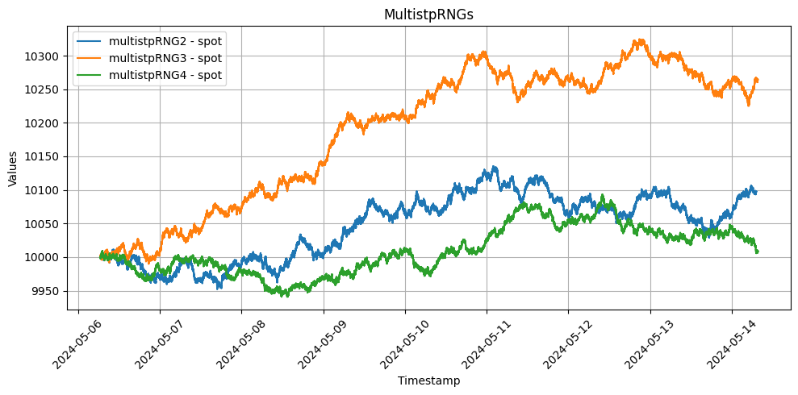

We found some few cases of missing ticks, however, this is a known issue:

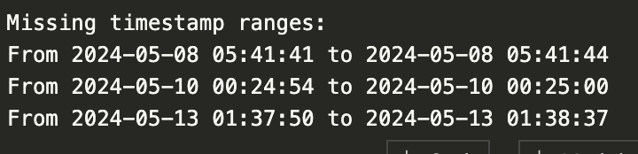

## Correlations

We checked for the correlation of the simple returns and expecting the pair-wise correlations to be 0. Otherwise, we might exposed to concentration risk and potential arbitrage.

### Results
It is evident that there are no pair-wise correlation between the indices.

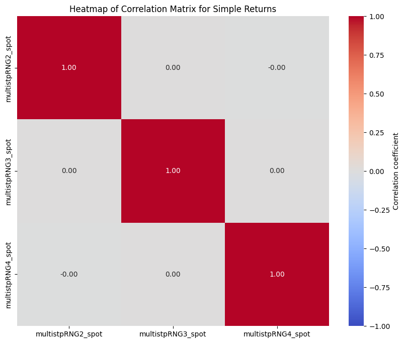

## Moments & Volatility
We checked the long term moments and the volatility of returns of each indices;

- By symmetry, the drift & skew should be zero or at least, near zero.
- Expected volatility from the specifications:

|                    | Estimated volatility |
|--------------------|----------------------|
| **MultistpRNG2**   | 8.36%                |
| **MultistpRNG3**   | 7.65%                |
| **MultistpRNG4**   | 6.81%                |

### Results

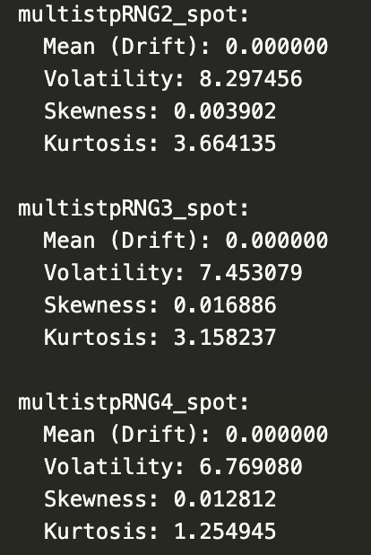

The moments are within the expected value.

## Parameter estimation
We estimate the parameter as a sanity check

### Results
All the step sizes and its probability matches the specifications;

  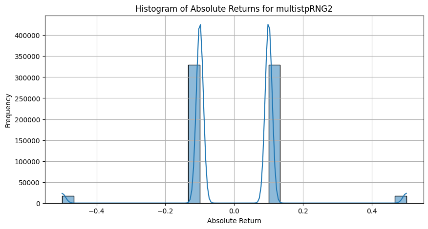
  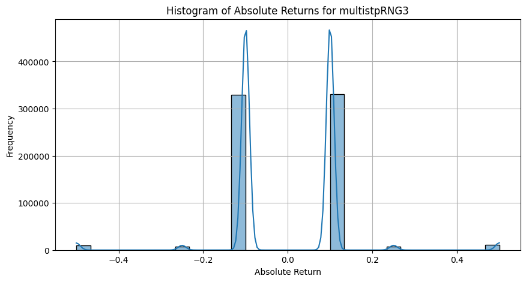 
  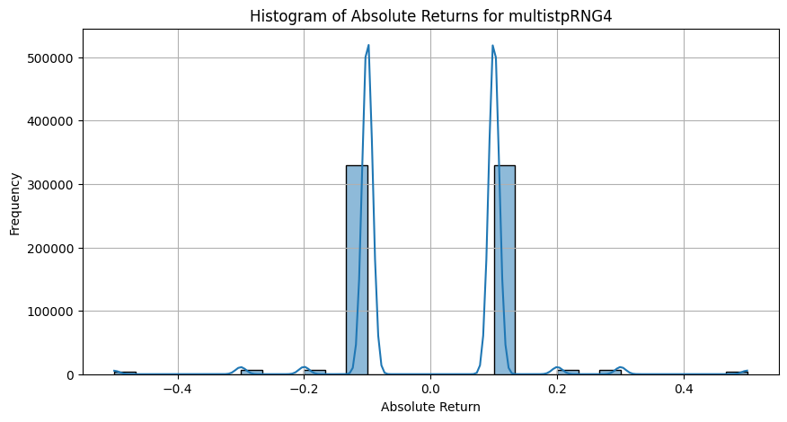

  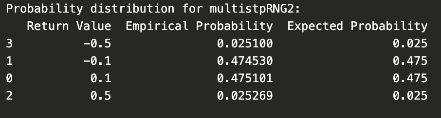
  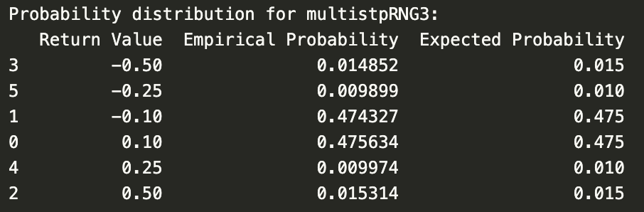 
  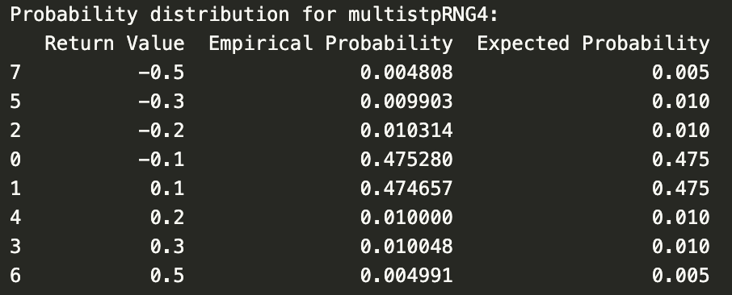

## Clients Trading Statistics

We checked both the Win Rates & Hit Ratios for each indices from release data until 13th of June

### Results
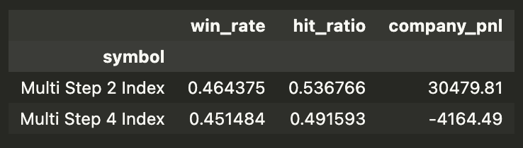

Inspite of the subpar company win rate values, investigation found that some clients with a very high volume trades tends to close the winning trades and let the losing trades open, this is evident when we checked the **company win rate of the still-open position**;

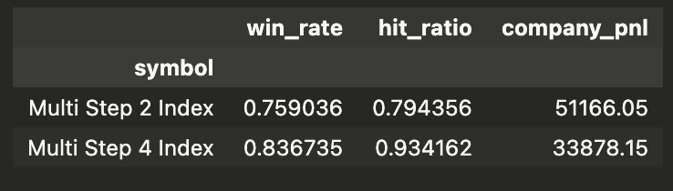

## Probability of going below zero, $P(x_t<0)$

Since the indices are based on the discrete random walks, there are non-zero probability of the indices going below zero. We estimate the probabilities that the position $x_t$ will be less than zero after 1, 3, and 5 years. The analysis utilizes the Central Limit Theorem (refer Appendix).

### Summary of Methodology

The random walk is defined by:
$x_t = x_0 + \sum_{i=1}^{t} s_i$
where:
- $x_0 = 10,000$ (initial position),
- $s_i$ represents the step taken at time $i$, drawn from a set of predefined step sizes each associated with specific probabilities.

The normal approximation for the position $x_t$ after $n$ steps is given by:
$x_t \sim \mathcal{N}(x_0 + n \mu, n \sigma^2)$
where:
- $\mu$ is the expected value of a single step,
- $\sigma^2$ is the variance of a single step.

Then we calculate the probability of going negative;

- **Probability** $P(x_t < 0)$: Using the cumulative distribution function (CDF)

### Results
Evidently, there are non-zero chance of the index going below zero, but it is negligible:
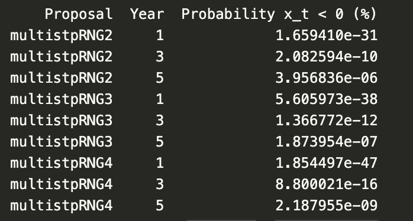

# Appendix
## Central Limit Theorem Application to Multistep Indices

The Central Limit Theorem (CLT) is a fundamental result in probability theory that states the distribution of the sum of a large number of independent, identically distributed (i.i.d.) random variables approaches a normal distribution, regardless of the original distribution of these variables. This principle can be applied to random walks (multistep indices), where each step is an independent random variable with a defined probability distribution.

### Conditions for CLT

The CLT applies under specific conditions:
1. **Independence**: Each step $s_i$ in the random walk is independent of the others.
2. **Identically Distributed**: Each step is drawn from the same distribution throughout the process.
3. **Finite Mean and Variance**: The distribution of the steps has a finite mean $\mu$ and variance $\sigma^2$.

### Calculation of Mean and Variance

For a random variable $X$ representing the step size, the mean and variance are given by:
- Mean: $\mu = E[X] = \sum x_i \cdot p_i$,
- Variance: $\sigma^2 = E[(X - E[X])^2] = E[X^2] - (E[X])^2 = \sum x_i^2 \cdot p_i$.

### Normal Approximation Using CLT

Given the steps are i.i.d. with finite mean and variance, the CLT states that the normalized sum:

$$
Z_n = \frac{\sum_{i=1}^n s_i - nE[X]}{\sqrt{n}\sigma}
$$

converges in distribution to a standard normal distribution as $n \rightarrow \infty$.

### Application to Multistep Indices

For a random walk starting at position $x_0$, the position after $n$ steps is:

$$
x_t = x_0 + \sum_{i=1}^n s_i,
$$

which, by the CLT, approximates to:

$$
\frac{x_t - x_0 - nE[X]}{\sqrt{n}\sigma} \sim N(0, 1)
$$

as $n \rightarrow \infty$. Thus, $x_t$ can be modeled by the normal distribution:

$$
x_t \sim N(x_0 + nE[X], n\sigma^2).
$$

### Probability of Negative Position

The probability that $x_t$ is less than zero can be calculated using the CDF of the normal distribution:

$$
P(x_t < 0) = \Phi\left(\frac{-x_0 - nE[X]}{\sqrt{n}\sigma}\right),
$$

where $\Phi$ is the CDF of the standard normal distribution.

## Document links

1. [Proposal - Multi Step Indices](https://docs.google.com/spreadsheets/d/1jXUgWcUBu65sGPmrvSw379ImBETL9jrb-I9MtK97DZ0/edit?usp=sharing)

R&D effort needs to be in line with Deriv’s vision and mission as formulated by our CEO. Therefore all R&D projects are carefully selected by our C-Level senior management represented by JY and Rakshit and resources for the projects are only allocated after review and shortlisting based on their vision and priorities.
In line with the standards and criterias set out by the CEO, the Model Validation team has validated the product/indices as documented in this report.
