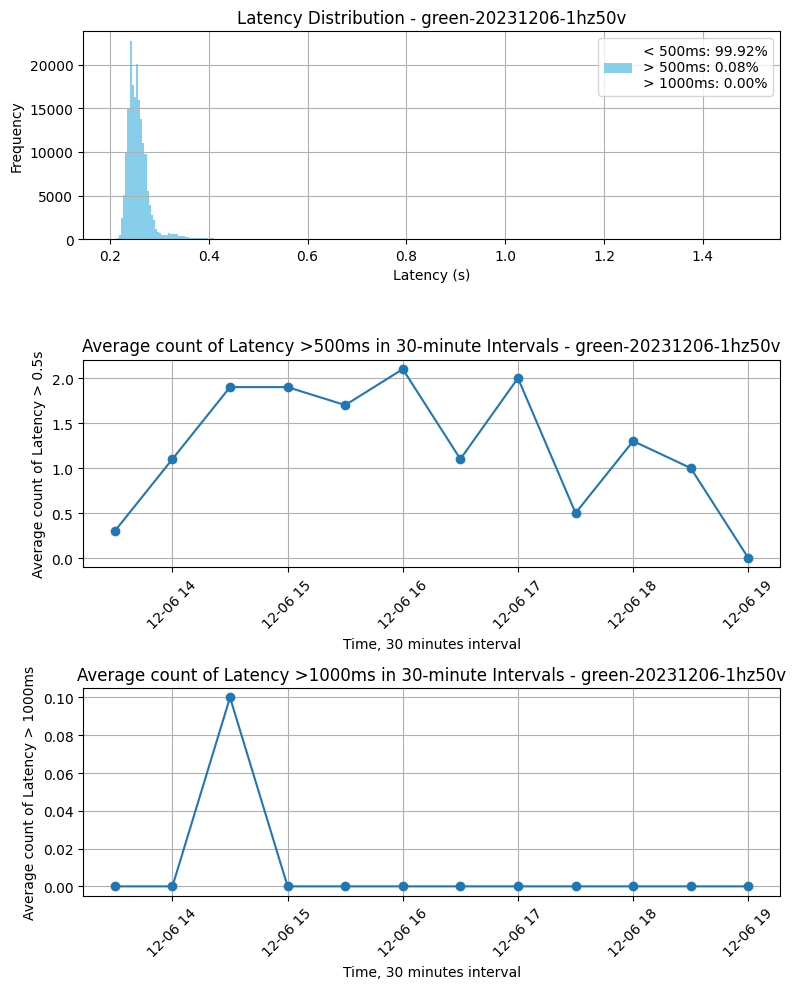
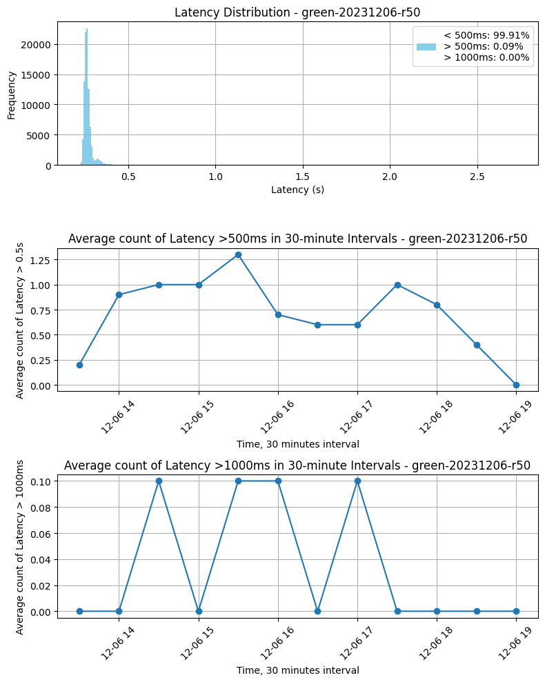

# Accumulator Validation

Latest update - 6th February 2023

### <u>Squad Members</u>

| Area             | Person In Charge                                    |
| :--------------- | :-------------------------------------------------- |
| Squad Leader     | Harsh Karamchandani (harsh@regentmarkets.com)       |
| Project Manager  | Ricardo Delgado (ricardo.delgado@regentmarkets.com) |
| Product Owner    | Nolan (nolan@regentmarkets.com)                     |
| Backend          | Niloofar Torkamani (niloofar@regentmarkets.com)     |
| Frontend         | Maryia Hryshchuk (maryia@regentmarkets.com)         |
| QA               | Paveetra (paveetra@regentmarkets.com)               |
| Model Validation | Amir (amir.naser@deriv.com)                         |

## Summary

The validation process for Accumulator on Synthetic indices covers Dtrader (website and mobile), API testing, BackOffice tools, and Product Specification, including but limited to Barrier Size Formula, validating growth rate offered, payout and convergence rate of the survival probability for accumulator in every indices.

Contract parameters such as stake, growth rate, duration, and take profit were chosen at random while all the indices are tested. Testing on risk monitoring tools in Back-Office were also conducted.

Total observation:

- 32 issues found.
  
  - 9 resolved
  - 0 blocker.
  - 23 non-blocker.

Green environment showed a favourable status, with no concentrated events of latency occurring. However, based on the latency analysis results, <b>prioritizing the launch of 2-second indices before introducing 1-second indices is deemed a suitable and rational decision</b>.

Report in the form of slides [here](https://drive.google.com/drive/folders/1VNACPqlMS2Kj9aMfMXAn2bdV-gAVxMVL).
Validation working file [here](https://github.com/regentmarkets/quants-model-validation/blob/master/Validation/Products/Accumulators%20(Synthetics)/validation_working_file.ipynb).

## Product information

A contract type with continuous Payout growth if loss event hasn't happened and zero Payout if loss event happens.

#### Terms and Conditions

Client pays:

$$
\text{Stake}
$$

Client's Payout:

$$
\text{Payout} =
\begin{cases}
\text{Stake} \times (1 + \text{g})^n &\text{Event(survive)}\\
0 &\text{else}
\end{cases}
$$

where:

$$
\begin{align*}
\text{g} &= \text{Growth Rate} \\
\text{n} &= \text{Passed Ticks}
\end{align*}
$$

#### Deriv's Growth rate vs Fair Growth Rate

Deriv's growth rate is given by:

$$ g_{} = P(\text{loss}) $$

For a payout to be fair for every tick, the fair growth rate has to be:

$$
\begin{align*}
\text{Stake} \times g \times P(\text{survive}) - \text{Stake} \times P(\text{loss}) &=  0 \\
\text{Stake} \times g \times P(\text{survive}) &= \text{Stake} \times P(\text{loss}) \\
g \times (1 - P(\text{loss})) &= P(\text{loss}) \\
g &= \frac{P(\text{loss})}{1 - P(\text{loss})}
\end{align*}
$$

There are <b>no direct commission</b> charging by deriv. The theoretical fair growth rate is greater than the growth rate offer by Deriv, the difference between them is Deriv's edge to earn commission.

| Deriv's Growth Rate | Fair Growth Rate (3sf) |
| :-----------------: | :--------------------: |
|        0.01         |         0.0101         |
|        0.02         |         0.0204         |
|        0.03         |         0.0309         |
|        0.04         |         0.0417         |
|        0.05         |         0.0526         |

### Offerings

This validation covers all the below indices, although the final decision has been made not to offer Jump, Crash and Boom indices due to the asymmetric distribution of these indices.

- Volatility 10, 25, 50, 75, 100 (1s) Index
- Volatility 10, 25, 50, 75, 100 Index
- Jump 10, 25, 50, 75, 100 Index
- Crash 300, 500, 1000 Index
- Boom 300, 500, 1000 Index

### Growth Rate Offering

- 1%, 2%, 3%, 4%, 5%

### Accumulator Barrier

Upper and lower barrier is given by:

$$\text{upper barrier} = \text{spot price} (1 + \text{barrier size})$$

$$\text{lower barrier} = \text{spot price} (1 - \text{barrier size})$$

To obtain an expression for barrier size,

$$ P(\text{Loss}) = P\left(\frac{S_t - S_{t-1}}{S_{t-1}} > b\right) + P\left(\frac{S_t - S_{t-1}}{S_{t-1}} < -b\right) $$

## Validation Methodology

### Overview

All instruments that offers accumulator alongside with all growth rate (1%,2%,3%,4%,5%) are tested. The indices, the growth rate, and the contract duration were randomly selected (including the edge case at minimum and maximum value) when purchasing contract using API.

#### Validation Areas
- Barrier Size
  <!-- - Validating the value of barrier size used in the yaml file with the calculated value using analytical formula. -->
- Barrier Production
  <!-- - Comparison of the upper and lower barrier value streamed from the API and the calculated value. -->
- Payout
  <!-- - Comparison of the payout values streamed from the API and the calculated value. -->
- Survival Rate
  <!-- - Validating the probability of survival for each instrument and growth rate using historical data. -->
- Strategy Test on the Accumulator
  <!-- - A simple trading strategy was applied to each instrument and growth rate, and the win rate and PnL (profit and loss) of the strategy were evaluated. -->
- Back Office Tools
  <!-- - To validate the risk management tools in the BackOffice are correctly implemented: -->
    - Max Payout
    - Max Duration
    - Risk Profile for Max Stake per account
    - Max Open Positions
    - Max Daily Volume
    - Max Aggregate Open Stake
    - Total Open Stake per Account
    - Hard Limit on Max Duration and Max Aggregate Open Stake
    - Account Specific Limit 
      - Max Open Position
      - Max Daily Volume
      - Max Daily PnL
      - Max Stake per trade
    - Global Realised Loss

## Validation Findings

### Summary of Findings

| Scope                 | # Observations | Resolved | Non-blocker (Future improvements) | Non-blocker (No action required) | Blocker |
| :-------------------- | :------------: | :------: | :----------------------------------: | :---------------------------------: | :-----: |
| <b>Total Observations |      <b>32      |    9     |                  23                   |                  -                  |    -    |
| DTrader               |       17        |    5     |                  12                   |                  -                  |    -    |
| DTrader  (Mobile)     |       6        |    2     |                  4                   |                  -                  |    -    |
| API                   |       1        |    -     |                  1                   |                  -                  |    -    |
| Back Office           |       6        |    1     |                  5                   |                  -                  |    -    |
| Other                 |       2        |    1     |                  1                   |                  -                  |    -    |

## DTrader

DTrader issues are listed [here](https://docs.google.com/presentation/d/1gyQdNNgfN2vCbntLuaxRv0tahi9dBCksulmm7W42szQ/edit?usp=drive_link)
|No. | Issue(s) | Status |
| :- | :- | :- |
|1 |The barrier/range is 'NaN%' when the input stake is not valid. on the growth rate percentage. | Resolved |
|2 |The warning error on invalid stake should be pointed to stake as well.    Resolved only for minimum value, if the stake is more than the max value, same problem still occuring. | Non-blocker (Future improvements)|
|3 |Tooltip that briefly explain maximum payout and maximum ticks should be included in the box.| Resolved |
|4 |The animation on contract details is not smooth. | Resolved |
|5 |Maximum Payout and Maximum ticks should change based on the stake.   For eg: <li>Maximum Payout should display min(10k, payout of maximum ticks) <li> Maximum ticks should display min(Back Office value, # of ticks to hit 10k)|Non-blocker (Future improvements) |
|6 |Show sell button right after client bought a contract instead of ‘you can only purchase one…’.|Non-blocker (Future improvements) |
|7 |The payout growth shows +0.00 for small stake (like BTC, ETH) | Resolved |
|8 |Stats will stop updating on invalid stake value. | Non-Blocker |
|9 |The values shown in the stats are misleading. | Non-blocker (Future improvements) |
|10 |Could not buy contract using foreign/crypto currencies with valid stake.| Resolved |
|11 |Max Payout and Max Ticks shows 0 or “nothing” upon invalid stake input.| Non-blocker (Future improvements) |

Additional observations by structuring quants team on dtrader. Refer [here](https://docs.google.com/document/d/1sYMwQSsTVfcGc8qL-8xMhHXBo9qA-yJOF5eg414dyxs/edit) for more details.
|No. | Issue(s) | Status |
| :- | :- | :- |
|1 |If the client loses, the recent position shows different parameters. It happens in contract details as well | Non-Blocker |
|2 |Sometimes, the stats below will not update | Non-Blocker |
|3 |Entry tick not plotted correctly sometimes if clients go to the contract details immediately after buying a contract | Non-Blocker |
|4 |The flag logo background is not transparent| Non-Blocker |
|5 |Barriers with 5 decimal places may not be seen if the index price > 10000. Still viewable from responsive, but the last digit is outside the blue box.| Non-Blocker |
|6 |The barrier is not updating in the background when there is an error message |Non-Blcoker|

## DTrader (Mobile)

DTrader (Mobile) issues are listed [here](https://docs.google.com/presentation/d/1QzpANbcizR6eA5mjN2Ye0Ns1PShmsTJ6oT5kbYcZ-XY/edit?usp=sharing)
|No. | Issue(s) | Status |
| :- | :- | :- |
|1 |The default view does not show the growing profit. | Resolved |
|2 |Cannot Instantly sell contracts on mobile. (Important for accumulator) | Resolved|
|3 |Tooltip symbol ‘i’ not showing (yet clickable) when user enter invalid stake amount.| Non-blocker (Future improvements) |
|4 |The placement of value of PnL in Trade Table and Statement can be enhanced. | Non-blocker (Future improvements) |
|5 |Recent positions that are expired/sold cannot be cleared.|Non-blocker (Future improvements) |

Additional observations by structuring quants team on dtrader. Refer [here](https://docs.google.com/document/d/1sYMwQSsTVfcGc8qL-8xMhHXBo9qA-yJOF5eg414dyxs/edit) for more details.
|No. | Issue(s) | Status |
| :- | :- | :- |
|1 |Clients unable to close Growth rate window until the contract ends if they buy a contract and accidentally touch the growth rate button immediately afterwards | Non-Blocker |

## API

API issues are listed [here](https://docs.google.com/presentation/d/1Wn8uxAOTvpy-1-mGOG1RltvaY6ZvXllhUkVK88UkGNQ/edit?usp=drive_link)

|            Area             | Test Cases | Pass | Fail |
| :-------------------------: | :--------: | :--: | :--: |
|      Tick Size Barrier      |    105     | 105  |  0   |
|     Barrier Production      |     45     |  45  |  0   |
| Payout per Ticks Production |     11     |  11  |  0   |
|     Missing Ticks on POC    |     67     |  59  |  8   |

|No. | Issue(s) | Status |
| :- | :- | :- |
|1 |Missing a tick (only tick_passed = 1 or 0) with probability of around 15-20%. It won’t happen in the event of barrier knock out (contract end).| Non-blocker (Future improvements) |

## Back Office Issues

Back Office issues are listed [here](https://docs.google.com/presentation/d/1JjeRKWj6Y6Ls8I2Xd08JAgWQDPthTkK9KqZk1wgya0U/edit?usp=drive_link)

|No. | Issue(s) | Status |
| :- | :- | :- |
|1 |Maximum stake on BTC is 0.0000005 BTC (0.015 USD). This issue is consistent for all other currencies. This is resolved for hard limit value in the  perl configuration and backoffice tools. | Resolved |
|2 | Certain backoffice configuration may cause server to crash. | Non-Blocker |
|3 | Bug with Max Stake Soft Limit | Non-Blocker |

Additional observations by structuring quants team on dtrader. Refer [here](https://docs.google.com/document/d/1sYMwQSsTVfcGc8qL-8xMhHXBo9qA-yJOF5eg414dyxs/edit) for more details.
|No. | Issue(s) | Status |
| :- | :- | :- |
|1 |Couldn’t disable some of the growth rates | Non-Blocker |
|2 |The content when the stake is the maximum payout is incorrect | Non-Blocker |
|3 |Maximum Daily Volume Error message is not clear (Raised by Dealing Team before) | Non-Blocker|

  
## Other Issues

Other issues are listed [here](https://docs.google.com/presentation/d/1JjeRKWj6Y6Ls8I2Xd08JAgWQDPthTkK9KqZk1wgya0U/edit?usp=drive_link)

- [Non-Blocker] The survival probability rate of Crash/Boom indices does not converge fast to the expected value (especially Crash 1000), as compared to volatility and jump indices.
  - For instance, the survival probability of the volatility and jump indices converge to the expected value within 2-3 days, while Crash 1000 needs 4 months to converge.
  - Due to that, client may have positive PnL and high Win Rate based on our strategy testing for Crash 1000.

- [Resolved] The payout growth shows +0.00 for small stake (like BTC, ETH) because the value is too small.

### Strategy Test Result

|          Strategy          | Test Cases | Negative PnL | Positive PnL |
| :------------------------: | :--------: | :----------: | :----------: |
| Buy contract every n ticks |    210     |     206      |      4       |

## Latency and Performance Analysis

The accumulator's performance is highly affected by latency. For instance, if a client decides to sell a contract that may have already terminated three seconds earlier, the client would loses the stake amount. 

Hence the essential requirement for a meticulous assessment of index latency data.

1) To assess the potential for selling errors caused by tick latency (delayed receipt of knockout information)
2) To assess latency distribution, this involves examining frequency of delays in receiving information.

#### Selling error due to latency results

|          Test          | Test Cases | Pass | Fail |
| :------------------------: | :--------: | :----------: | :----------: |
| Sell contract just after 3rd tick is received |    1006     |     1003     |   3 

#### Latency Distribution and Average Count of Latency every 30 minutes

##### Methodology
- Evaluated 10 simultaneous connections on green (real accounts) environments for 1Hz50V and R50 parameters.
- Generated latency distribution plots for analysis.
- Calculated the average count of events in 30 minutes interval where latency exceeded 500 milliseconds and 1000 milliseconds.

##### Results on 6th December 2023 on green environment (after backend improvement)

### Key takeaway 
- Green environment displays promising progress.
- There's no concentrated event 
- Thresholds set: 500ms for 1s indices, 1000ms for 2s indices.
- Rarely breaches 1000ms for 2s indices (0.1 occurrences every 30 mins) as per graph.
- More frequent breaches over 500ms for 1s indices (1-2 occurrences every 30 mins) as per graph.

Consequently, based on this evaluation, the launch of the 2-second indices is considered a more prudent choice.

# Appendix
#### Important Documents and Links
| Document | Link | 
| :- | :- | 
| Initial Specifications | https://docs.google.com/spreadsheets/d/19gpXjPz4Y8buwgJhQYF2DhVNi4tro1gbEk8ZGyBq0r0/edit#gid=672427211 |
| Specification  | https://docs.google.com/document/d/1cc7IV5hTfaW30CDpQE0NcBj4KcOnGnQz/edit|
| Remaining Specification |https://docs.google.com/document/d/1FmT31s7gesYyC18IxkQH9iVY3xPQv4PCLhjPPp5BA0A/edit|
| Tick Size Barriers for Accumulators | https://docs.google.com/document/d/1E4uZLCzgmG9yM_syxpdhqxWbQdeUEZD4PTTVMvkE1oc/edit?pli=1 |
| Risk Management Framework for Accumulator | https://docs.google.com/document/d/1eh6PVA2ceRt9chNewHFe7Tw362h-KslNTfek10t9zo0/edit?pli=1 |
| To control concentration risk | https://docs.google.com/document/d/1YgCSUhD3ekm4XGtGNBIf_UNsIsc_KPhhn3HFf9ZCnH0/edit?pli=1#heading=h.nmu1tme86jam |
| Accumulator Soft & Hard Limit | https://docs.google.com/spreadsheets/d/1bDfUD4Zsu9HaTySh4n54GfGz40sNzSWEIcQb-DGp4d4/edit#gid=0 |
| Accumulator Demo Metabase Dashboard |https://metabase-bi.4x.my/dashboard/760-accumulator-demo-trade-performance-30-days|
| Structuring's sanity check | https://docs.google.com/document/d/1sYMwQSsTVfcGc8qL-8xMhHXBo9qA-yJOF5eg414dyxs/edit |

### Tick Size Barrier for Vol Indices

#### Calculation of tick size barrier for Volatility Indices

We know that

$$
\ln\left(\frac{S_t}{S_{t-1}}\right) \sim N\left(-\frac{\sigma^2 dt}{2}, \sigma^2 dt\right)
$$

Thus,

$$
P(\text{Loss}) = 1 - N\left(\frac{\ln(1+b)+\frac{\sigma^2 dt}{2}}{\sigma \sqrt{dt}}\right) + N\left(\frac{\ln(1-b)+\frac{\sigma^2 dt}{2}}{\sigma\sqrt{dt}}\right)
$$

### Tick Size Barrier for Jump Indices

#### Calculation of tick size barrier for Jump Indices

For our jump process, let 

$$ 
P = \frac{72}{86400}e^{-\frac{72}{86400}}
$$

The Jump Index is distributed as follows:

$$
\begin{align*}
\ln\left(\frac{S_t}{S_{t-1}}\right) &\sim N\left(-\frac{901\sigma^2 dt}{2}, 901\sigma^2 dt\right), \text{if } U < P \\
\ln\left(\frac{S_t}{S_{t-1}}\right) &\sim N\left(-\frac{\sigma^2 dt}{2}, \sigma^2 dt\right), \text{if } U > P 
\end{align*}
$$

We can obtain,

$$
\begin{align*}
&P\left(\ln\frac{S_t}{S_{t-1}} < \ln(1 + b)\right) \\
&= N\left(\frac{\ln(1+b)+\frac{901\sigma^2 dt}{2}}{\sigma \sqrt{901dt}}\right) \cdot P + N\left(\frac{\ln(1+b)+\frac{\sigma^2 dt}{2}}{\sigma \sqrt{dt}}\right) \cdot (1 - P)
\end{align*}
$$

Similarly, for the other term,

$$
\begin{align*}
&P\left(\ln\frac{S_t}{S_{t-1}} < \ln(1 - b)\right) \\
&= N\left(\frac{\ln(1-b)+\frac{901\sigma^2 dt}{2}}{\sigma \sqrt{901dt}}\right) \cdot P + N\left(\frac{\ln(1-b)+\frac{\sigma^2 dt}{2}}{\sigma \sqrt{dt}}\right) \cdot (1 - P)
\end{align*}
$$

Thus,

$$
\begin{align*}
&P(\text{Loss}) \\
&= 1 - N\left(\frac{\ln(1+b)+\frac{901\sigma^2 dt}{2}}{\sigma \sqrt{901dt}}\right) \cdot P - N\left(\frac{\ln(1+b)+\frac{\sigma^2 dt}{2}}{\sigma \sqrt{dt}}\right) \cdot (1 - P) \\
&\quad + N\left(\frac{\ln(1-b)+\frac{901\sigma^2 dt}{2}}{\sigma \sqrt{901dt}}\right) \cdot P + N\left(\frac{\ln(1-b)+\frac{\sigma^2 dt}{2}}{\sigma \sqrt{dt}}\right) \cdot (1 - P)
\end{align*}
$$

### Tick Size Barrier for Crash/Boom Indices

#### Calculation of tick size barrier for Crash/Boom Indices

$$
\begin{align*}
\text{Let } P &= \text{up probability} \\
1 - P &= \text{down probability}
\end{align*}
$$

$$
P(\text{Loss}) \text{ consists of} 
\begin{array}{ll} 
P\left(\ln\frac{S_t}{S_{t-1}} > \ln(1 + b)\right), \text{this only happens when no crash/boom happens with probability } P \\
P\left(\ln\frac{S_t}{S_{t-1}} < \ln(1 - b)\right), \text{this only happens when crash/no boom happens with probability } 1 - P 
\end{array}
$$

In other words,

$$
\begin{align*}
&P(\text{Loss}) \\
&= P\left(\ln\frac{S_t}{S_{t-1}} > \ln(1 + b)\right) + P\left(\ln\frac{S_t}{S_{t-1}} < \ln(1 - b)\right) \\
&= P\left(\ln\frac{S_t}{S_{t-1}} > \ln(1 + b) \middle| \space U < P\right) \cdot P(U < P) \\
&\quad + P\left(\ln\frac{S_t}{S_{t-1}} < \ln(1 - b) \middle| \space U > P\right) \cdot P(U > P) \\
&= P\left(\frac{MUT |N(1,1)|\sqrt{dt}}{\mu} > \ln(1 + b) \right) \cdot P \\
&\quad + P\left(\frac{MDT |N(1,1)|\sqrt{dt}}{\mu} < \ln(1 - b)\right) \cdot (1 - P) \\
&= P\left(|N(1,1)| > \frac{\ln(1 + b)\mu}{MUT\sqrt{dt}} \right) \cdot P \\
&\quad + P\left(|N(1,1)| < \frac{\ln(1 - b)\mu}{MDT \sqrt{dt}}\right) \cdot (1 - P) \\
&= \left(P\left(N(1,1) < -\frac{\ln(1 + b)\mu}{MUT\sqrt{dt}} \right) + P\left(N(1,1) > \frac{\ln(1 + b)\mu}{MUT\sqrt{dt}} \right)\right) \cdot P \\
&\quad + \left(P\left(N(1,1) > -\frac{\ln(1 - b)\mu}{MDT \sqrt{dt}}\right) + P\left(N(1,1) < \frac{\ln(1 - b)\mu}{MDT \sqrt{dt}}\right)\right) \cdot (1 - P) \\
&= \left(P\left(Z < -\frac{\ln(1 + b)\mu}{MUT\sqrt{dt}} - 1\right) + P\left(Z > \frac{\ln(1 + b)\mu}{MUT\sqrt{dt}} - 1 \right)\right) \cdot P \\
&\quad + \left(P\left(Z > -\frac{\ln(1 - b)\mu}{MDT \sqrt{dt}} - 1\right) + P\left(Z < \frac{\ln(1 - b)\mu}{MDT \sqrt{dt}} - 1\right)\right) \cdot (1 - P)
\end{align*}
$$

R&D effort needs to be in line with Deriv’s vision and mission as formulated by our CEO. Therefore all R&D projects are carefully selected by our C-Level senior management represented by JY and Rakshit and resources for the projects are only allocated after review and shortlisting based on their vision and priorities. 

In line with the standards and criterias set out by the CEO, the Model Validation team has validated the product/indices as documented in this report.                                                                                                  
