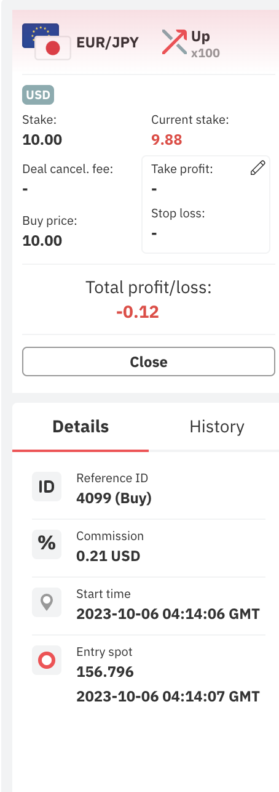
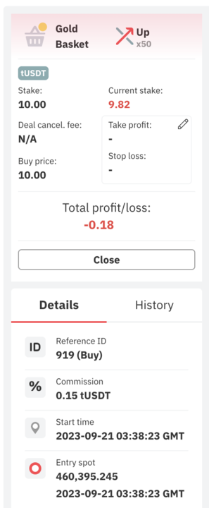
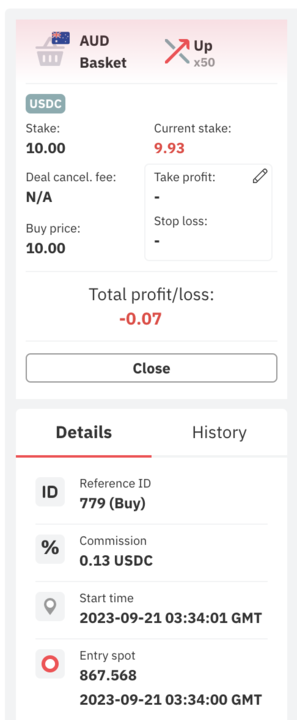

# Multiplier on Forex Major Pairs/Cryptocurrencies/Basket indices relaunch validation

Latest update - 6th of October 2023

### <u>Squad Members</u>

| Area             | Person In Charge                                    |
| :--------------- | :-------------------------------------------------- |
| Product Owner    | Simo (simo.dafir@deriv.com)|
| Scrum Master     | - |
| Project Manager  | Ekaterina Davidovich (ekaterina@deriv.com)|
| Backend          | Jun Bon (junbon@deriv.com)|
| Frontend         | - |
| QA               | - |
| Model Validation | Matthew / Amir (mathew.chan@deriv.com / amir.naser@deriv.com) |

## Summary

This report covers the validation on Multiplier next tick implementation on entry/start spot. The validation also covers Forex Major Pairs, Basket Indices and Cryptocurrencies.

To summarize the result:
- 2 issues found.
  - 0 Blocker
  - 1 Non-Blocker
  - 1 Resolved

The Non-Blocker issue is that the next tick has yet implemented for all Basket Indices. It is not a blocker as we can relaunch the multipliers for FX Major Pairs and Cryptocurrencies first.

## Context

A group of clients consistently profits from the Financial Multiplier product due to:

- The inability to hedge our product. 

- Latency by our current feed infrastructre.

The solution chosen is to implement the next tick as a simple solution. Details on the issue in [wiki js](https://wikijs.deriv.cloud/en/trading/dealing/trading-ops_non-linear/trading-incident-investigation-registry/incidents/incident_financial_multiplier_group_traders_2022).

## Validation Methodology

To check on API & Dtrader for all the multiplier contract start using next tick and end using current/latest tick.

#### Underlying Offerings Checked:

- FX major pair
  - frxAUDJPY
  - frxAUDUSD
  - frxEURAUD
  - frxEURCHF
  - frxEURGBP
  - frxEURJPY
  - frxEURUSD
  - frxGBPAUD
  - frxGBPJPY
  - frxGBPUSD
  - frxUSDCAD
  - frxUSDCHF
  - frxUSDJPY
- Forex Basket Index
  - WLDAUD
  - WLDEUR
  - WLDGBP
  - WLDUSD
- Commodities Basket
  - WLDXAU
- Cryptocurrencies
  - cryBTCUSD
  - cryETHUSD

Also to check the changes is not applied on synthetics indices.

## Validation Findings

#### Summary of Findings

Link to slide [here](https://docs.google.com/presentation/d/1sxxDOJs4NIcyzUKBi5S8qBCL4gTXDpMGpWG4iKl7JDo/edit?usp=sharing)

|No. | Issue(s) | Status |
| :- | :- | :- |
|1 | Can't close contract when use usdc, usdt, eusdt, tusdt.| Resolved (Issue only happen in QA box) |
|2 | FX/Gold Basket still uses current tick instead of next tick for entry/start | Non-Blocker (Future Improvement) |

#### Result 

|            Area             | Entry | Exit |
| :-------------------------: | :--------: | :--------: | 
| FX Major Pair |    Next tick     | Current/Latest Tick |
|  FX Basket |   Current/Latest Tick  | Current/Latest Tick |
| Commodity Basket (Gold) |     Current/Latest Tick |   Current/Latest Tick |  | 
| Crypto |     Next tick        | Current/Latest Tick |

## Appendix
#### Example of contract bought in Dtrader:
Passed case: Image shows FX contract using next tick in Dtrader.

Failed case: Image shows gold contract using current/latest tick in Dtrader:

 R&D effort needs to be in line with Deriv’s vision and mission as formulated by our CEO. Therefore all R&D projects are carefully selected by our C-Level senior management represented by JY and Rakshit and resources for the projects are only allocated after review and shortlisting based on their vision and priorities. 

In line with the standards and criterias set out by the CEO, the Model Validation team has validated the product/indices as documented in this report.

