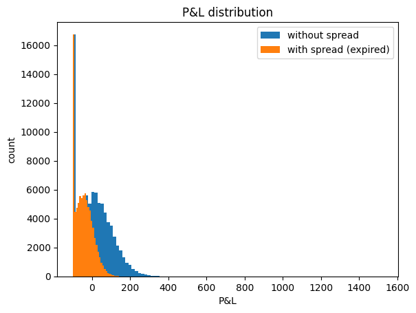

# Turbo Validation

Latest update - 21st of December 2023

### <u>Squad Members</u>

| Area             | Person In Charge                                    |
| :--------------- | :-------------------------------------------------- |
| Product Owner    | Simo Dafir (simo.dafir@regentmarkets.com)   |
| Project Manager  | Ekaterina (ekaterina@regentmarkets.com)|
| Backend          | Kok Jun Bon (junbon@regentmarkets.com)     |
| Frontend         | Kate Mikhasiova / Maryia Hryshchuk (kate@regentmarkets.com / maryia@regentmarkets.com)|
| QA               |      Shariqh Shaikh (shariqh@regentmarkets.com)        |
| Model Validation | Matthew / Amir (matthew.chan@regentmarkets.com / amir.naser@regentmarkets.com)                    |

## Summary

The validation process for Turbos on Volatility indices covers Dtrader (website and mobile), API testing, BackOffice tools, and Product Specification, including but limited to deriving Black-Scholes Formula, validating the pricing model with spread, the allowable barriers offered to clients and minimum and maximum stake.

Contract parameters such as turboslong/turbosshort, duration, stake, and take profit were chosen at random while all the volatility indices are tested. Testing on risk monitoring tools in Back-Office were also conducted. Spread parameters, which set in Backoffice, are also validated.

Total observations:

- 27 issues found.
  - 13 Resolved.
  - 14 Non-Blocker.

Report in the form of slides [here](https://drive.google.com/drive/folders/1sNg_IylrD0oCY0J-04i0u6-LExICft3f). 
Working file for the validation process [here](https://github.com/regentmarkets/quants-model-validation/blob/master/Validation/Products/Turbos%20(Synthetics)/validation_working_file.ipynb).

## Product information

The buyer of the Long/Short Turbo will participate in any increase/decrease above/below a predetermined barrier.

However the client bears the risk that the turbo option will be knocked out and early terminated if the spot price touches or breaches a predetermined barrier.

In a Turbo Option, the <b>knock-out barrier, $B$ and the strike, $K$ are equal</b> and the options are offered in the money at the start of the trade. 

### Underlying Offerings

- Volatility 10, 25, 50, 75, 100 (1s) Index
- Volatility 10, 25, 50, 75, 100 Index

### Duration

- 5 to 10 ticks
- 15 seconds to 60 seconds
- 1 minute to 60 minutes
- 1 hour to 24 hours
- 1 day to 365 days

### Product Replication and Close Form Formula
#### Black-Scholes Pricing

We can use Black-Scholes Model for Down-and-Out Call option and Up-and-Out Put option to price Turbos (refer appendix for derivation). The <b>close form formula for turbos without comission</b> is given by:

Long Turbos (Down-and-Out Call):
  
$$
\text{S}-\text{K}
$$

Short Turbos (Up-and-Out Put):
  
$$
\text{K}-\text{S}
$$

#### Spread Model

|             | Long Turbos | Short Turbos |
| :---------: | :---------: |:----------: |
| Enter Trade |  Ask - $B$  | $B$ - Bid |
| Close Trade |  Bid - $B$  | $B$ - Ask |

where,

$$
\text{Ask} = S_{t} \times (1 + \text{Ask Spread})
$$

$$
\text{Bid} = S_{t} \times (1 - \text{Bid Spread})
$$

and,

$$
\begin{aligned}
\text{Ask Spread} &= \text{Average Tick Size Up in Fixed Table} \times \text{Ticks Commission Up in BO} \\
\text{Bid Spread} &= \text{Average Tick Size Down in Fixed Table} \times \text{Ticks Commission Down in BO} 
\end{aligned}
$$

Remark: We only charge a commission when entering or closing the contract. Thus, there is **no commission when the contracts expire at expiry date**.

#### Terms & Conditions

Client pays:

$$
\text{Stake}
$$

Client's Payout:
  - for Long Turbos:

$$
\begin{align*}
\text{Payout} &=
\begin{cases}
n \times (\text{Bid}-B) &\text{Manually Sell/Take Profit}\\
n \times (S_t-B) &\text{Expired Contract}\\
0 &\text{Event(Knock Out)}
\end{cases}\\\\
n &= \frac{\text{Stake}}{ \text{Ask}-B} 
\end{align*}
$$
- for Short Turbos:

$$
\begin{align*}
\text{Payout} &=
\begin{cases}
n \times (B-\text{Ask}) &\text{Manually Sell/Take Profit}\\
n \times (B-S_t) &\text{Expired Contract}\\
0 &\text{Event(Knock Out)}
\end{cases}\\\\
n &= \frac{\text{Stake}}{B-\text{Bid}} 
\end{align*}
$$

### Barrier Choices

$$
\begin{align*}
\text{Barrier Choices} &= S \times \text{max}\left( \sigma \sqrt{\frac{t}{dt}}, \frac{1}{N_{max}\times S}\right)\times(1 + \alpha)^i, \quad i = 1,2,3,...,n\\\\
\alpha &=   \space_n\sqrt{\frac{0.5}{\text{max}\left( \sigma \sqrt{\frac{t}{dt}}, \frac{1}{N_{max}\times S}\right)}} - 1
\end{align*}
$$

where,
- $S$ is the current spot price
- $\alpha$ is the barrier growth rate
- $\sigma$ is the volitility of the index
- $n$ is the number of barrier - 1
- $t$ is a term to adjust the minimum distance and the growth rate (the higher t, the further the minimum distance and the lower the ɑ)
- $dt = 365 \times 24 \times 60 \times 60$

#### Rules for updating the barriers
Barrier choices are updated every 1 hour unless the spot changes too much within the hour, that is if:

$$
\begin{align*}
\text{Current Spot} &> \left( 1 +  \sigma \sqrt{\frac{t}{dt}}\right) \times \text{Spot price in the last update}\\
&\qquad\qquad\qquad\quad\text{or}\\
\text{Current Spot} &< \left( 1 -  \sigma \sqrt{\frac{t}{dt}}\right) \times \text{Spot price in the last update}\\
\end{align*}
$$

## Validation Methodology
### Overview

All indices that offers Turbos were validated along with all time offerings. The indices, the barrier choice, and the contract duration were randomly selected (including the edge case at minimum and maximum value) when purchasing contract using API. The commission parameter were set according to the specification.

  
#### Validation Areas
- Product Specification
  - Fixed Table Values
- API Validation
    - Barrier Choices
    - Duration
    - Min/Max Stake
    - Deriv's Commission/Markup
    - Sell price (Manually & at Expiry)
- Dtrader Validation
- Dtrader Mobile Validation
- Back Office Tools Validation
    - Configuration for affiliate commission
    - Turbo Display Barrier configuration
    - Commission section
    - Min and Max stake 
    - Maximum number of open positions per instrument per client
    - Company’s realise loss configuration
    - Flexibility to suspend trading
    - Maximum number of open positions
    - Maximum daily PnL
    - Max multiplier stake and multiplier
- Strategy testing analysis (gap option).

### Assumption

Most testing is done in the QA Box environment as many fixes were made ad hoc with BE team and deployed straight into our QA Box for testing. Hence, the assumption is the production should be (almost) the same as the test environment.

## Validation Findings

### Summary of Findings

| Scope                 | Slide | # Observations | Resolved | Non-blocker (Future improvements) | Blocker |
| :-------------------- | :----:| :------------: | :------: | :----------------------------------: | :-----: |
| <b>Total Observations | - |      <b>27     |    13     |                  14                  |    -    |
| Specification         |[link](https://docs.google.com/presentation/d/1XVhUHwX5hL79E8yqKPSRI1IECUOwomRO2eUKQO2izIc/edit?usp=sharing) |      3        |    -     |                  3                   |    -    |
| DTrader               |[link](https://docs.google.com/presentation/d/1WuaGRFPpPNwraa_7WE2lIwBL8YU5M76pDlUUznuNnWU/edit?usp=sharing) |       18       |    9     |                  9                  |    -    |
| DTrader Mobile        |[link](https://docs.google.com/presentation/d/1ASUuyP7T_Uc7qwlmfZ4B8NhrjHeKOkBPaI73Naq1LU8/edit?usp=sharing) |      5        |    4     |                  1                   |    -    |
| API                   |[link](https://docs.google.com/presentation/d/1g6EwbmNMssIYkXIX4GYfIP0Sy0jMmpx6Fe2ns9CSor8/edit?usp=sharing) |       1        |    -     |                  1                   |    -    |

## Specification

Specification issues are listed [here](https://docs.google.com/presentation/d/1XVhUHwX5hL79E8yqKPSRI1IECUOwomRO2eUKQO2izIc/edit?usp=sharing).

No. | Issue(s) | Status |
| :- | :- | :- |
|1 | Take profit is not intuitive | Non-Blocker |
|2 | The absence of exp(-rt) in the formula| Non-Blocker |
|3 | Different exposure to duration when missing tick occurs | Non-Blocker |
## DTrader

DTrader issues are listed [here](https://docs.google.com/presentation/d/1WuaGRFPpPNwraa_7WE2lIwBL8YU5M76pDlUUznuNnWU/edit?usp=sharing).
|No. | Issue(s) | Status |
| :- | :- | :- |
|1 |Inconsistent number of decimals for barrier choices | Resolved |
|2 |The "take profit" feature can be consistently exploited to force a winning trade. | Resolved |
|3 |Removing take profit from a contract, closes the contract with profit | Resolved |
|4 |Max Stake doesn’t update when user input invalid stake.| Non-Blocker |
|5 |In contract details long code, 'Barrier' or 'Strike' is more straight forward instead of 'Entry Point minus value'| Non-Blocker |
|6| The product description currently lacks explicit mention of commission charges when client manually sell the contract. | Non-Blocker |
|7 | Tooltip on payout per point is not clear. | Non-Blocker |

Additional observations by structuring quants team on dtrader. Refer [here](https://docs.google.com/document/d/1Qp2NKB5ZxYP4leITksPDG37J7v36p01pVRl5trYtog0/edit) for more details.
|No. | Issue(s) | Status |
| :- | :- | :- |
|1 |Entry spot is the previous tick when the current tick isn’t available and the barrier is calculated from the tick. However, the duration starts counting after the current tick. System may not match Start Time and Entry Spot. | Resolved |
|2 |Spot prices of tick contracts may be blocked by the longcode in Desktop (contract 223125499308) | Non-Blocker |
|3 |Entry spot, Exit spot and Barrier should use same pip size (# of decimal) as the index, it happens to Vanillas as well in both Desktop and Responsive (contract 223218741768) | Resolved |
|4 |Profit shown is different in recent positions for all contracts, it shows the profit when clients win but shows the payout when clients lose.| Resolved |
|5 |Ticks are not plotted correctly sometimes for ongoing tick contracts. This was raised by QA a long time ago in tick contracts for other trade types.| Non-Blocker |
|6 |Exit tick is sometimes returned incorrectly, but the profit calculation is correct (contract 223137916628) |Resolved|
|7| Barriers are not symmetrical for Long and Short Turbos | Resolved | 
|8| Remove the extra spacing below for Barriers tooltip in Desktop and Responsive.| Non-Blocker |
|9| When the current profit/loss is 0, it will not be shown out. This may cause clients unable to sell sometimes.|Resolved|
|10| Indicative profit/loss always shows an arrow up when the profit is positive and arrow down when it is negative. Correct behaviour should be showing arrows depending on the previous price.| Non-Blocker|
|11|The arrow next to the Payout per point should only be shown out when it is greater than/lesser than the previous tick but not every tick, just like the arrow of total profit/loss on the left. The current default behaviour is to show a down arrow when there is no change.|Non-Blocker|

## DTrader Mobile

DTrader Mobile issues are listed [here](https://docs.google.com/presentation/d/1ASUuyP7T_Uc7qwlmfZ4B8NhrjHeKOkBPaI73Naq1LU8/edit?usp=sharing).
|No. | Issue(s) | Status |
| :- | :- | :- |
|1 |Unattractive design of Long/Short Display on mobile  | Resolved |
|2 |Mobile shows “Risk management - not set” instead of take profit | Resolved |
|3 |Upon a user touch/hold the tooltip, the tooltip remains persistent and does not automatically disappear as expected.| Resolved |

Additional observations by structuring quants team on dtrader mobile. Refer [here](https://docs.google.com/document/d/1Qp2NKB5ZxYP4leITksPDG37J7v36p01pVRl5trYtog0/edit) for more details.
|No. | Issue(s) | Status |
| :- | :- | :- |
|1 |The issue of the x-axis for the feed is still there since Vanillas, where the x-axis changes every second when zoomed in too close.   | Non-Blocker |
|2 |Recent positions is still being blocked after a contract is bought  | Resolved |

## API
API issues are listed [here](https://docs.google.com/presentation/d/1g6EwbmNMssIYkXIX4GYfIP0Sy0jMmpx6Fe2ns9CSor8/edit?usp=sharing).

|            Area             | Test Cases | Pass | Fail |
| :-------------------------: | :--------: | :--: | :--: |
|      Strike Price Choices (Barrier)      |    105     | 105  |  0   |
|     Payout per Point     |     45     |  45  |  0   |
| Duration |     11     |  11  |  0   |
| Min/max stake price |     67     | 59  |  8   |
| Sell Price |     67     | 59  |  8   |

|No. | Issue(s) | Status |
| :- | :- | :- |
|1 |Exit tick time can be after expiry time.| Resolved |

## Gap option trading (potential exploit)

In the context of gap option trading for turbos, assume the following conditions:

* Strike Price Proximity: The strike price provided is deliberately set very close to the entry spot, with a parameter 't' is set to 1.
* Contract Duration: The contract duration is set to 1 tick.

We assume both are true in this simulation, the result is as follows:

Without spread being applied, turbos are exposed to a potential exploit, wherein clients can consistently profit from gap options. The figure below illustrates the difference in profit and loss distributions between scenarios with and without the spread implemented:

The absence of the spread results in a P&L distribution that skews notably towards the positive side. This contributes significantly to the client's consistent positive P&L, despite experiencing losses in stakes during downturns.

##### Key takeaways:
 - The spread model in place effectively mitigated potential exploits.
 - Additionally, setting 't' to a value of 300 and ensuring a minimum contract duration of 5 ticks helps to prevent the possibility of gap option.
 - Clients are restricted to purchasing contracts using strike price choices provided by Deriv, even when using API requests.

# Appendix
#### Important Documents and Links
| Document | Link | 
| :- | :- | 
| Specifications | https://docs.google.com/document/d/1FhxGBpUmW8JW3cDrFDR3UzdlAlEK5yzy/edit?pli=1 |
| Back-End Specifications | https://docs.google.com/document/d/1QLb52jL8TnlPSRA2YAOoCSFVRdgE-P4OXoW_x5Ksm8k/edit?pli=1#heading=h.5k1w82n7hns0 |
| Backoffice tool for turbo options on synthetic products | https://docs.google.com/document/d/1Gm9vXfcZqiPB_-IA6p3R9oRLfHdYcyp7IrmAEORNZ9M/edit?pli=1 |
| Turbos Table in Backoffice | https://docs.google.com/document/d/1YwEDrvhhGlM7yz2c3hotjsFatsdyWQ9Zl8AqLc2j2rc/edit?pli=1 |
| Barrier Parameter Table | https://docs.google.com/document/d/1r4XcxXXcZCf46CxBO4hib34dPHjFBRnyr2x4bMXtZbY/edit |
| Updated Barrier Configuration | https://docs.google.com/document/d/1gunkVaNMI6lwZyRLHv0RQa1K02boN0sH4xAGq9akgWA/edit?pli=1 |
| Turbos in practice - BE, design, usability | https://docs.google.com/document/d/1Xl8yoDUCIogZptXu_TUpkDxbOVPn9BqTFEPvqe1LJ9c/edit?usp=sharing |
| Turbos Risk Management Tools Testing | https://docs.google.com/document/d/1GsGm0Y1QXjUF04H3S-2kZBKPmbuIvkHck2gP5v54TVc/edit |
| Structuring's Findings | https://docs.google.com/document/d/1Qp2NKB5ZxYP4leITksPDG37J7v36p01pVRl5trYtog0/edit |
#### Price Model Derivation
A down-and-out call is one type of knockout option. It is a regular call option that ceases to exist (knock out) if the underlying price reaches a certain barrier, $H$. The barrier level is below the initial spot price.

The corresponding knock-in option is a down-and-in call. This is a regular call that comes into existence (knock in) only if the underlying price reaches the barrier level.

If $H$ is less than or equal to the strike price, $K$, the value of a down-and-in call at time zero is 

$$
\begin{align*}
Call_{down-and-in} = e^{-rt}\left(F\frac{H}{S}^{2\lambda}N(y)-K\frac{H}{S}^{2\lambda-2}N(y-\sigma\sqrt{T})  \right)   
\end{align*}
$$

Where:
* $\lambda=\frac{r-q+\sigma^2/2}{\sigma^2}$
* $y=\frac{\ln({H^2/S_0K})}{\sigma\sqrt{T}}+\lambda\sigma\sqrt{T}$

The value of the regular call equals the value of a down-and-in call plus the value of a down-and-out call, hence, the value of a down-and-out call is given by;

$$
\begin{aligned}
Call_{down-and-out}&=Call-Call_{down-and-in}\\
&=e^{-rt}\left( FN(x_1)-KN(x_1-\sigma\sqrt{T}) - F\frac{H}{S}^{2\lambda}N(y_1)+K\frac{H}{S}^{2\lambda-2}N(y_1-\sigma\sqrt{T})     \right)
\end{aligned}
$$

Subsequently, up-and-out put is given by;

$$
\begin{aligned}
Put_{up-and-out}&=Put-Put_{up-and-in}\\
&=e^{-rt}\left( -FN(-x_1)+KN(-x_1+\sigma\sqrt{T}) + F\frac{H}{S}^{2\lambda}N(-y_1)-K\frac{H}{S}^{2\lambda-2}N(-y_1+\sigma\sqrt{T})     \right)\\
\end{aligned}
$$

* $x_1=\frac{\ln({S/H})}{\sigma\sqrt{T}}+\lambda\sigma\sqrt{T}$
* $y_1=\frac{\ln({H/S})}{\sigma\sqrt{T}}+\lambda\sigma\sqrt{T}$

For Turbos on Synthetics, we set:
* $F = S$
* $r\space=q=0$
* $\lambda\space =\frac{0+\sigma^2/2}{\sigma^2}=\frac{1}{2}$
* $H = K$

$$
\begin{aligned}
Turbo\space Long&=Call-Call_{down-and-in}\\
&= FN(x_1)-KN(x_1-\sigma\sqrt{T}) - F\frac{H}{S}^{2\lambda}N(y_1)+K\frac{H}{S}^{2\lambda-2}N(y_1-\sigma\sqrt{T})     \\
&= SN(x_1)-KN\left(x_1-\sigma\sqrt{T}\right) - S\frac{K}{S}N(y_1)+K\frac{S}{K}N\left(y_1-\sigma\sqrt{T}\right)  \\   
&=S\left(N(x_1)+N\left(y_1-\sigma\sqrt{T}\right) \right) - K\left(N(y_1)+N\left(x_1-\sigma\sqrt{T}\right) \right)\\\\
Turbo\space Short&=Put-Put_{up-and-in}\\
&= -FN(-x_1)+KN(-x_1+\sigma\sqrt{T}) + F\frac{H}{S}^{2\lambda}N(-y_1)-K\frac{H}{S}^{2\lambda-2}N(-y_1+\sigma\sqrt{T})         \\
&= -SN(-x_1)+KN\left(-x_1+\sigma\sqrt{T}\right) + S\frac{K}{S}N(-y_1)-K\frac{S}{K}N\left(-y_1+\sigma\sqrt{T}\right)  \\   
&=-S\left(N(-x_1)+N\left(-y_1+\sigma\sqrt{T}\right) \right) + K\left(N(-y_1)+N\left(-x_1+\sigma\sqrt{T}\right) \right)\\\\
\text{Where,}\quad\quad\quad\\
N\left(y_1-\sigma\sqrt{T} \right) &=N\left(\frac{\ln({K/S})}{\sigma\sqrt{T}}-\frac{1}{2}\sigma\sqrt{T}\right)\\
&=1- N\left(\frac{\ln({S/K})}{\sigma\sqrt{T}}+\frac{1}{2}\sigma\sqrt{T}\right)\\
&=1- N\left(x_1\right)\\\\
N\left(-y_1+\sigma\sqrt{T} \right) &=N\left(\frac{-\ln({K/S})}{\sigma\sqrt{T}}+\frac{1}{2}\sigma\sqrt{T}\right)\\
&=1- N\left(\frac{-\ln({S/K})}{\sigma\sqrt{T}}-\frac{1}{2}\sigma\sqrt{T}\right)\\
&=1- N\left(-x_1\right)\\\\
\text{Similarly,}\quad\quad\\
N\left(x_1-\sigma\sqrt{T} \right) &=1- N\left(y_1\right)\\
N\left(-x_1+\sigma\sqrt{T} \right) &=1- N\left(-y_1\right)\\\\
\text{Hence,}\quad\quad\space\space\space\\
 Turbo\space Long&=S\left(N(x_1)+(1 - N(x_1) \right)) - K\left(N(y_1)+(1 - N(y_1)) \right)\\
 &=S\left(N(x_1) - N(x_1)+1 \right) - K\left(N(y_1) - N(y_1)+1 \right)\\
 &=S\left(1 \right) - K\left(1 \right)\\
 &=S-K\\\\
 Turbo\space Short&=-S\left(N(-x_1)+(1 - N(-x_1) \right)) + K\left(N(-y_1)+(1 - N(y_1)) \right)\\
 &=-S\left(N(-x_1) - N(-x_1)+1 \right) + K\left(N(-y_1) - N(-y_1)+1 \right)\\
 &=-S\left(1 \right) + K\left(1 \right)\\
 &=K-S
\end{aligned}
$$

#### Reference
Hull, J. C. (2022). Chapter 26: Exotic Options. In Options, futures, and other derivatives (11e ed., pp. 620–622). essay, Pearson. 

R&D effort needs to be in line with Deriv’s vision and mission as formulated by our CEO. Therefore all R&D projects are carefully selected by our C-Level senior management represented by JY and Rakshit and resources for the projects are only allocated after review and shortlisting based on their vision and priorities. 

In line with the standards and criterias set out by the CEO, the Model Validation team has validated the product/indices as documented in this report.