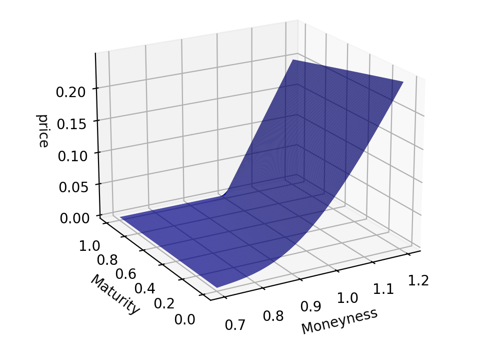

# Pricers Readme

This README file provides an explanation of how to use the `MC_pricer` and `pde_pricer` Python classes for options pricing using different methods.

## Table of Contents
- [MC Pricer](#mc-pricer)
  - [Introduction](#introduction-mc)
  - [Parameters](#parameters-mc)
  - [Usage](#usage-mc)
- [PDE Pricer](#pde-pricer)
  - [Introduction](#introduction-pde)
  - [Parameters](#parameters-pde)
  - [Usage](#usage-pde)

## MC Pricer <a name="mc-pricer"></a>

### Introduction <a name="introduction-mc"></a>
The `MC_pricer` class is designed to price options using the Monte Carlo method. It supports various types of options and allows for customization of path generation and averaging methods. The class takes several parameters to configure the pricing process.

### Parameters <a name="parameters-mc"></a>
The `MC_pricer` class constructor accepts the following parameters:

- `ref_spot` (float): Reference spot price.
- `strike` (float): Strike price/rate (K).
- `time_to_expiry` (float): Time to expiry/tenor (T).
- `option` (str): Option type. Currently supports ["call", "put", "digital_call", "digital_put", "sharkfinKO_call", "sharkfinKO_put", "sharkfinXP_call", "sharkfinXP_put"].
- `market` (str): The underlying market.
- `numberOfSamples` (int): The number of simulations of the market evolution.
- `barrier` (float, optional): Barrier price/rate (B).
- `path_generation` (str, default: 'standard'): The underlying market spot paths generation technique. Currently supports ["standard", "antithetic", "terminal stratification", "sobol", "halton"].
- `averaging_method` (str, default: 'standard'): The variance reduction technique used that acts on the payoff averaging after generating the paths. Currently supports ["standard", "CVoption", "CVunderlying"].
- `seed` (int, optional): The seed of the random number generator used for the simulation.
- `time_resolution` (float): The interval of times between two ticks.
- `**params`: Additional parameters used for paths generation or averaging techniques.

### Usage <a name="usage-mc"></a>
To use the `MC_pricer` class, you can follow these steps:

1. Import the module and create an instance of the class.
```python
from deriv_quant_package.pricer.pricing_engine.pricer import MC_pricer

# Create an instance of MC_pricer
pricer = MC_pricer(ref_spot=100, strike=105, time_to_expiry=1, option="call", market="1HZ100V", numberOfSamples=10000)
```

2. Retrieve the estimated price of the option.
```python
price = pricer.get_price()
```

3. Retrieve the simulated paths of the market value.
```python
paths = pricer.get_simulated_paths()
```

4. Retrieve the payoffs of the option according to the simulated market paths.
```python
payoffs = pricer.get_payOffs()
```

5. If needed, you can redraw the simulation with new parameters.
```python
pricer.redraw(S_0=110, T=2, N=20000, dt=0.01, seed=1234)
```

6. You can also reset the simulation to the initial paths and parameters.
```python
pricer.reset()
```

Note: Make sure to customize the parameters according to your specific option and market requirements.

For more details on the implementation and usage, please refer to the program code and comments.

## PDE Pricer <a name="pde-pricer"></a>

### Introduction <a name="introduction-pde"></a>
The `pde_pricer` class is designed to price options using the Black-Scholes model with the PDE (finite difference) method. It supports both European and American options, as well as various option types and boundary conditions. The class takes several parameters to configure the pricing process.

### Parameters <a name="parameters-pde"></a>
The `pde_pricer` class constructor accepts the following parameters:

- `ref_spot` (float): Reference spot price.
- `strike` (float): Strike price/rate (K).
- `riskless_rates` (float or numpy.ndarray): Risk-free rate(s) (r).
- `time_to_expiry` (float): Time to expiry/tenor (T).
- `vols` (float or dict): Volatilities (sigma). When dict, format must be: {1: {x1: mkt_vol1, .... xN: mkt_volN}, 365: {x1: mkt_vol1, .... xN: mkt_volN}, ...}
- `option` (str): Option type. Currently supports ["call", "put", "digital_call", "digital_put","up_out_call","up_in_call", "down_out_call","down_in_call","down_out_put","down_in_put","up_out_put","up_in_put", "sharkfinKO_call", "sharkfinKO_put", "sharkfinXP_call", "sharkfinXP_put"].
- `barrier` (float, optional): Barrier price/rate (B) for barrier options.
- `dividend_rates` (float or numpy.ndarray, default: 0): Dividend rate(s) (q).
- `american` (bool, default: False): If true, value an American-style option. Otherwise, value a European option.
- `riskless_rate_type` (str, default: "flat"): Interpolation type for risk-free rates.
- `dividend_rate_type` (str, default: "flat"): Interpolation type for dividend rates.
- `volsurface_type` (str, default: "flat"): Interpolation type for the volatility surface. Currently supports ["flat", "quadratic", "cubic", "vv"]
- `volsurface_interp` (str, optional): Additional interpolation method for the volatility surface. Currently supports [None, "TPS_local_vol"]
- `market` (str, default: "forex"): Reference market.
- `N_S` (int, default: 100): Number of points in the spot-axis to use.
- `N_t` (int, default: 30): Number of points in the time-axis to use.
- `scheme` (str, default: "crank_nicolson"): Finite difference scheme to use.
- `solver` (str, default: "fast"): Solver to use in the finite difference method.
- `boundary` (str, default: "dirichlet"): Boundary condition style.
- `grid_shift` (bool, default: False): Apply grid shifting.
- `smoothing` (float, default: 0.0): Smoothing parameter for volatility interpolation across strike.
- `min_value_for_local_vol` (float, default: 0.0): Threshold for local volatility surface.
- `gap_with_existing_points` (float, default: 0.1): Minimum gap (in moneyness direction) with existing points when adding new points.
- `gap_between_new_points` (float, default: 0.1): Minimum gap (in moneyness direction) between new points when adding points to the data.
- `number_new_points` (int, default: 10): Number of points to add on the left and right of the existing points when adding points to the data.

### Usage <a name="usage-pde"></a>
To use the `pde_pricer` class, you can follow these steps:

1. Import the module and create an instance of the class.
```python
from deriv_quant_package.pricer.pricing_engine.pricer import pde_pricer

# Create an instance of pde_pricer
pricer = pde_pricer(
    ref_spot=1,
    strike=1,
    riskless_rates=0.01,
    dividend_rates=0.0,
    time_to_expiry=1,
    vols=vol_dict,
    option="sharkfinKO_call",
    barrier=1.20,
    american=False,
    N_S=600,
    N_t=600,
    solver="fast",
    boundary="dirichlet",
    grid_shift=True,
    volsurface_type="strike",
    volsurface_interp="TPS_local_vol",
    smoothing=0.0000,
    min_value_for_local_vol=0.1,
    gap_with_existing_points=0.05,
    gap_between_new_points=0.025,
    number_new_points=10
)
```

2. Get the solutions:
- Price surface:
```python
price_surface = pricer.get_price_surface(with_coords=True)
```

- Price curve:
```python
price_curve = pricer.get_price_curve(with_coords=True)
```

3. Get the price at a specific spot and tenor:
```python
price = pricer.get_price(spot=spot, tenor=tenor)
```

Note: Make sure to customize the parameters according to your specific option and market requirements.

For more details on the implementation and usage, please refer to the program code and comments.

Example of a price surface obtained with the PDE pricer:


